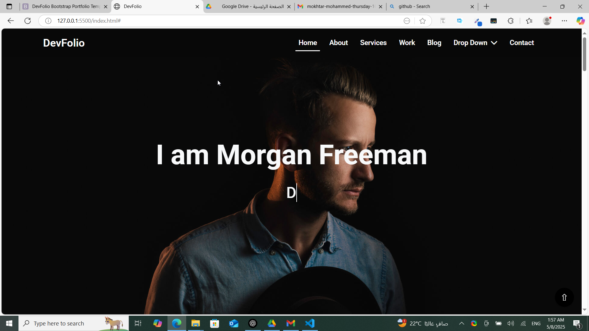

# DevFolio

The task was to work with Bootstrap to simplify and organize custom CSS as much as possible using the built-in tools that Bootstrap offers, aiming to improve efficiency and make design work easier.

## 🎯 What I learned:

In this project, I worked with CSS Grid and Bootstrap, gaining valuable insights on the following:

CSS Grid: Learned how to create complex, responsive layouts with less code. The flexibility of CSS Grid makes organizing content more intuitive and manageable.

Bootstrap: Focused on using Bootstrap's utility classes to simplify the CSS and avoid excessive custom styling. This allowed me to build a responsive design faster and more efficiently.

Responsive Design: Ensured the project is fully responsive, adapting seamlessly across different screen sizes and devices.

Flexibility: Improved my understanding of how to manage layout behavior across different platforms while maintaining consistency.

Code Organization: By reducing custom CSS and using Bootstrap, I achieved a more structured and maintainable codebase.
## 💡 Tools used:

- HTML5
- CSS
- bootstrap

## 📸 Preview:

